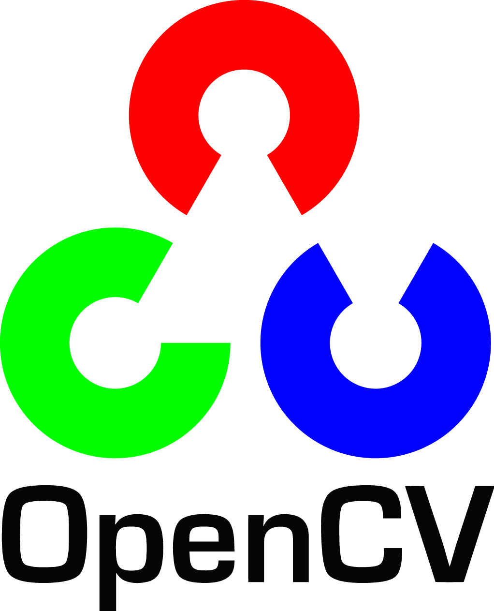
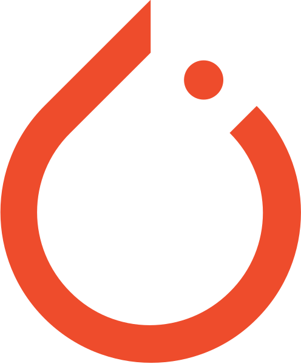

<h1 style="align-content: center;
           padding-right: 1rem;">
     <samp>Hi, I’m Susovan! 👨‍💻</samp>
    
    </a>
    
    
</h1>

I am a Python Developer and machine-learning enthusiast. I’m interested in Comptuer Vision. I am passionate about technologies and love to learn new things.

#### My Created Apps - 
* **Stone Paper Scissor Game** - A web game created in Python Flask. It is classic game and the Computer Vision makes it' more interesting and fun full to play. For visit the website [Click Here](https://stone-paper-scissors-game.herokuapp.com/)

* **Covid Vaccine Slot Notifier** - A Web Application is designed to send the Notification messages everyday to your Telegram Id of available Covid Vaccine Slot from the selected State and District of your choice with some extra filters. For visit the website [Click Here](https://covid-vaccine-slot-reminder.herokuapp.com/)

* **Virtual Painter** - A GUI Applications where we are drawing on the canvas by moving our hand. This app use our hand as the pointer and draw how our hand moves. This App is Created using Tkinter for the GUI part, for hand and it's landmarks detection we use Mediapipe and for other image related things we use OpenCV Module. For visit [Click Here](https://github.com/SusovanGithub/Tkinter-Applications/tree/master/Virtual-Painter/)

## Languages, Tools and Softwares

    &nbsp;&nbsp;
    &nbsp;&nbsp;
    &nbsp;&nbsp;
    &nbsp;&nbsp;
    &nbsp;&nbsp;
    
      
    &nbsp;&nbsp;
    &nbsp;&nbsp;
    &nbsp;&nbsp;
    &nbsp;&nbsp;
    &nbsp;&nbsp;
    &nbsp;&nbsp;
    &nbsp;&nbsp;
    
       
    &nbsp;&nbsp;
    
     

## GitHub Stats

## Most Used Languages

## Favourite Repository
&nbsp;&nbsp;

 
 
