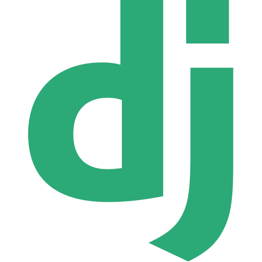

<h1 style="align-content: center;
           padding-right: 1rem;">
     Hi, I’m Susovan! 👨‍💻
    
    </a>
    
    
</h1>
I am a Python Developer and machine-learning enthusiast. I’m interested in Comptuer Vision. I am passionate about technologies and love to learn new things.

## Languages, Tools and Softwares

    &nbsp;&nbsp;
    &nbsp;&nbsp;
    &nbsp;&nbsp;
    &nbsp;&nbsp;
    
      
    &nbsp;&nbsp;
    &nbsp;&nbsp;
    &nbsp;&nbsp;
    &nbsp;&nbsp;
    &nbsp;&nbsp;
    &nbsp;&nbsp;
    
       
    &nbsp;&nbsp;
    

